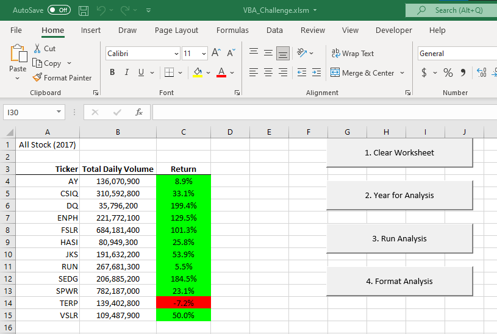
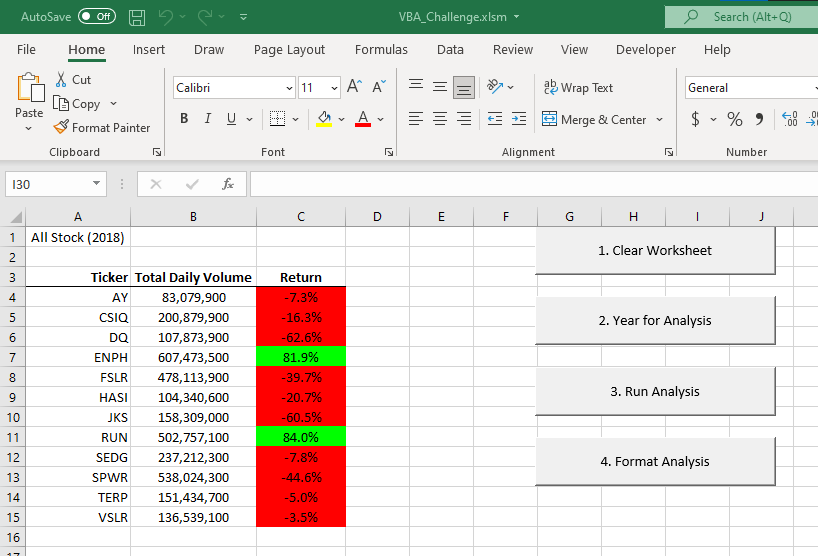
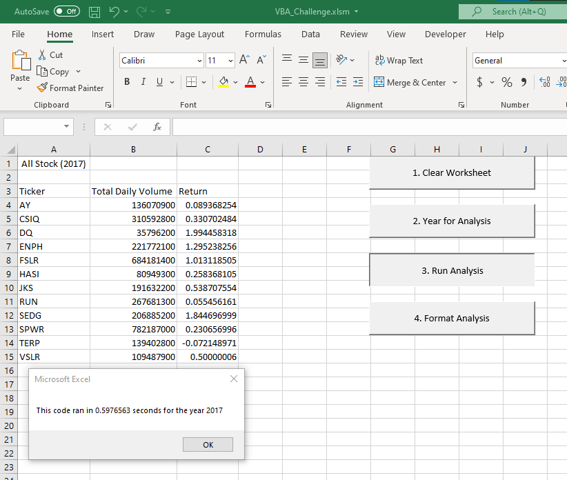
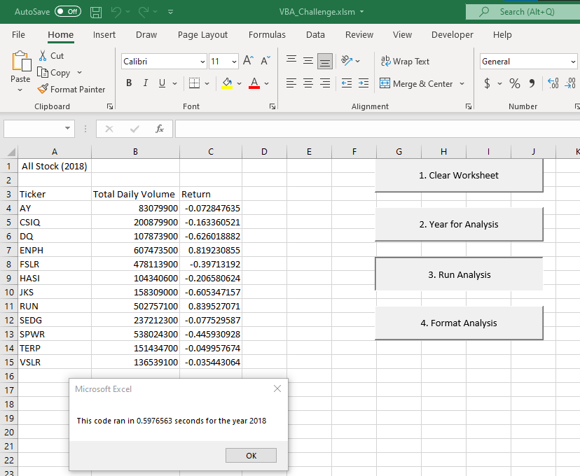
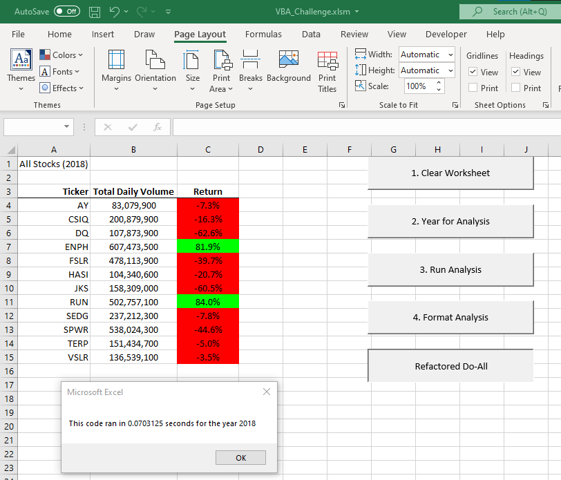

# Stock Analysis and Tool
##  Overview of Project
##### There is great interest for investment in today’s green energy market.  With that in mind the question was posed “What green energy stock show mass appeal for investment and strong returns?”

#### To fulfill this request a tool was created to quickly shuffle through to years of green energy stocks for the years 2017 and 2018 for each day of active trading.  The data set had Ticker Symbol, Date of Trade, Opening Price, Closing Price, the Highs and Lows of the day, Adjusted Close, and lastly Volume Traded for the day.

## Results, Findings, and Comments
#####  To address the concerns of investment directly generally, the year 2017 showed remarkable gains for almost all stocks.  TERP was the only that had losses for the year at -7.2% whereas most other companies had double and triple gains.

###### 2017 Green Energy Gains and Losses

#####  Despite the terrific gains demonstrated in 2017 almost all stock tumbled severally in 2018.  Only ENPH and RUN had gains for 2018 but their respective gains were still fantastic.

###### 2018 Green Energy Gains and Losses

#####  Overall, in recommending a stock for purchase the simple statement would be only to buy ENPH and RUN as they were the only two stocks that had positive gains for both years.  This is a very simple analysis and many of the stocks still retain a two-year gain over initial purchase.  Again, though, the safe bet would be the two stocks mentioned above.

##### To conduct this analysis a tool was created with two different methodologies and how these operate create large discrepancies in their execution times.  These will be discussed at length in the summary.  Just note that the speeds for execution eclipse that of the original script.

##### 2017 Original VBA Script

##### 2018 Original VBA Script

##### 2017 Refactored VBA Script

##### 2018 Refactored VBA Script

## Summary
##### As can be seen from the data sets above refactoring the code made a tremendous difference in the amount of run time for the script and while this may seem unimportant if the data set is expanded for more years or companies the run time could become quite large.  This is also significant because the timer in my code is only set to run during the analysis loop whereas the timer counts the entire code set for the refactored version.

##### The refactored code demonstrates roughly a 10 times improvement over the original script for 2017 and 2018.  Again, if this code is run to a larger scale this will become important.

#####  The fundamental difference between these two pieces of code is the way it loops through the data set.  In the first script, the code loops through the data looking for a predetermined sticker symbol  and acts on its instructions during the loop.  The number of iterations through the dataset is solely dependent on the number of company’s ticker symbols are being sought.

##### The refactored counters this method by stopping at each row and comparing it to the array and acting on the instructions if a symbol match is found.  In this manner the code spends more time at each row conducting operations but only loops once through the data set.

##### One last point of observation about these tools is that they both depend on a clean data set to operate.  The tool is dependent on the sticker symbols being grouped together and in order.   Therefore, this code will only operate on a managed dataset. 

##### Lastly, the original script has some of my own interpretations to it.  I used a button for each subroutine and just to play around with the feature of VBA.
